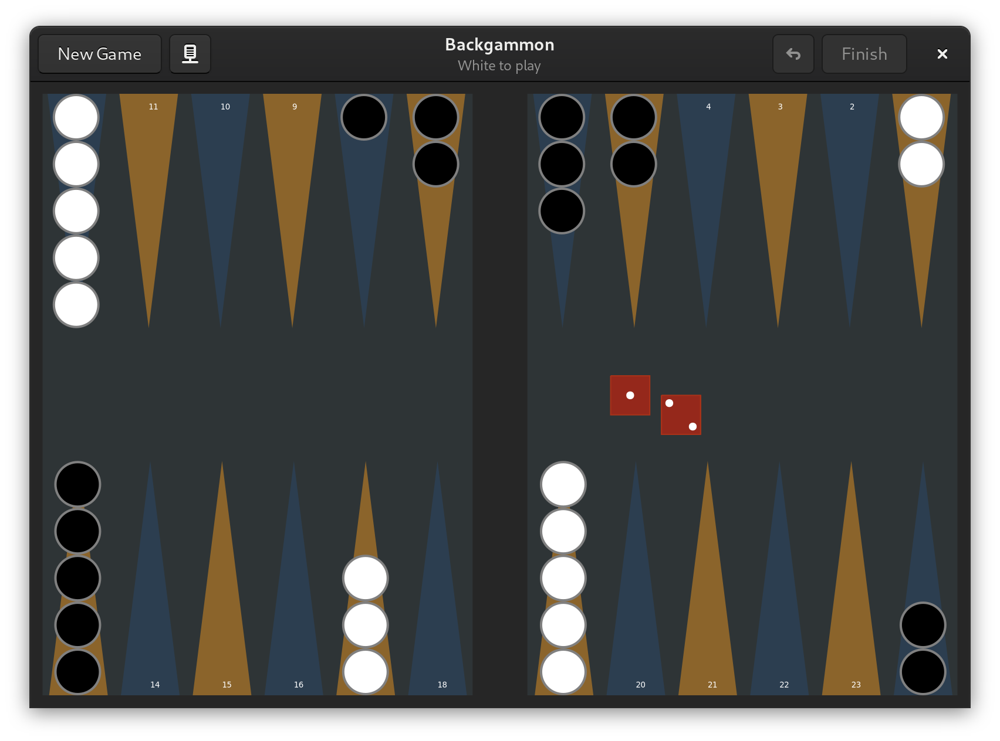
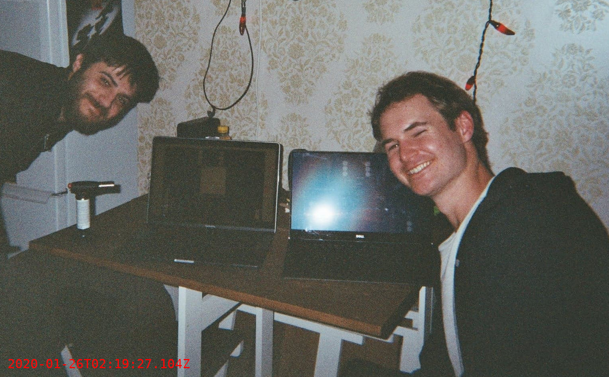

# Backgammon [](https://travis-ci.org/jonathanballs/backgammon)
A free backgammon game for the Linux desktop written in D which allows users to play against an AI, over LAN or even with players around the world over the internet. It's targeted towards casual play and thus forgoes the analysis and tutor features present in other backgammon software in favor of a more streamlined and pleasant user interface.



## Building

Backgammon is written in the D language so make sure that you have a D compiler and the Dub package manager installed. Navigate to the project directory and run:

```
dub build && ./backgammon
# Or for flatpak
flatpak-builder --install build-dir  uk.jnthn.backgammon.json --force-clean --user
```

Make sure that you install Gnu Backgammon if you wish to play against an AI as Backgammon does not have an AI currently.

### A historic event: The first backgammon game in its 5000 year history that was truly trustless


NB: The software crashed halfway through the game
